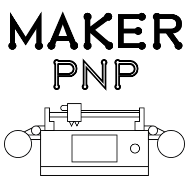

# MakerPnP

Cross-platform Pick-and-Place machine software, for Makers!

## Machine Operations

This repository is for the machine operations software which will include a GUI and control board firmware.

Other repositories in the MakerPnP organization contain GUI and CLI tools for pcb assembly planning, gerber viewer
and related libraries.

### Architecture and Responsibilities

There are currently three main parts to the system:

* the server application (see `server` folder)
* one or more IO-boards. (see `firmware` and `ioboard` folders)
* the operator UI (see `operator_ui` folder)

There is some shared code in `common`, refer to the dependencies of each application.

* The server's job is to own the configuration, coordinate ioboards, run/step jobs, do computer vision tasks, do high-level 
machine operations such as homing, diagnostics, feeding, picking, moving, placing, discarding, measuring, recording statistics, 
centralized logging, etc.  
* The IO-board(s) job is real-time machine control (sensors, motors, etc).
* The operator UI's job is to allow the operator to control the machine by interacting with the server.

The IO-board, server and operator UI can run on the same machine, or on different machines; depending on the implementation
of the IO-board firmware.  The architecture is specifically designed to be flexible and allow for different use-cases.

#### Example Use-Cases

1. Raspberry-Pi server, single MCU based IO-board, UI on Raspberry-Pi touch screen + 2nd monitor.
2. Raspberry-Pi server, single MCU based IO-board, UI on remote desktop machine (running natively, not VNC, etc).
3. Windows/Linux/MacOS server and UI on same machine, MCU based IO-board. 
4. Server + RT linux based IO-board, remote UI.
5. Multiple MCU based IO-boards (3-axis + head mount + multiple networked feeders), Windows/Linux server, UI running on MacOS.
6. Other combinations of the above.

Note: You can substitute 'Raspberry-Pi' with your favorite single-board Linux SoC platform, the Raspberry Pi is just an
example, though it /is/ specifically used and tested with during development.

## Links

Please subscribe to be notified of live-stream events so you can follow the development process.

* Patreon: https://www.patreon.com/MakerPnP
* Source: https://github.com/MakerPnP
* Discord: https://discord.gg/ffwj5rKZuf
* YouTube: https://www.youtube.com/@MakerPnP
* X/Twitter: https://x.com/MakerPicknPlace

## Authors

* Dominic Clifton - Project founder and primary maintainer.

## License

TBD (Probably GPL3, Apache or MIT)

## Contributing

If you'd like to contribute, please raise an issue or a PR on the github issue tracker, work-in-progress PRs are fine
to let us know you're working on something, and/or visit the discord server.  See the  section above.
