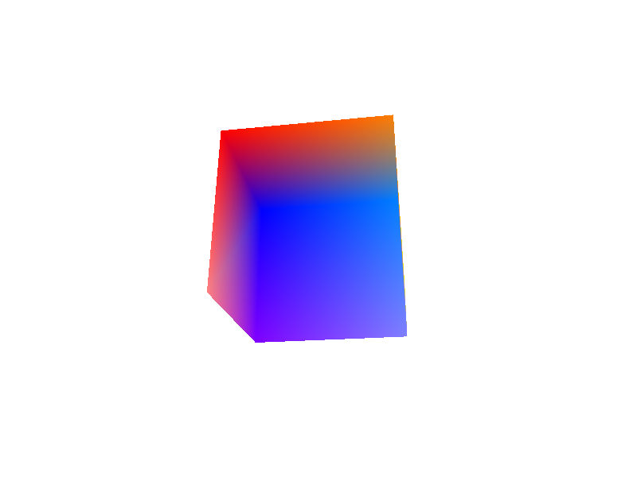

# Screen 13 - cli - 1

This experimentation attempts to use Screen13 to render a 3D scene to a png file.

## Dependencies

### Windows

```
vcpkg install shaderc:x64-windows
```

### Linux

Tested on a Raspberry Pi 5.

```
$ vulkaninfo | grep version
Vulkan Instance Version: 1.4.309
        apiVersion        = 1.3.305 (4206897)
        driverVersion     = 25.0.7 (104857607)
        conformanceVersion:
        apiVersion        = 1.4.305 (4210993)
        driverVersion     = 0.0.1 (1)
        shaderBinaryVersion  = 1
        conformanceVersion:
```

```
apt install vulkan-tools mesa-vulkan-drivers libvulkan-dev glslc
```

## Building shaders

Required glslc compiler.

See the scripts in `dist`

## Running

```
cargo run --release
```

## Output

The program generates a png file called `asserts/cube.png` (shown below)


