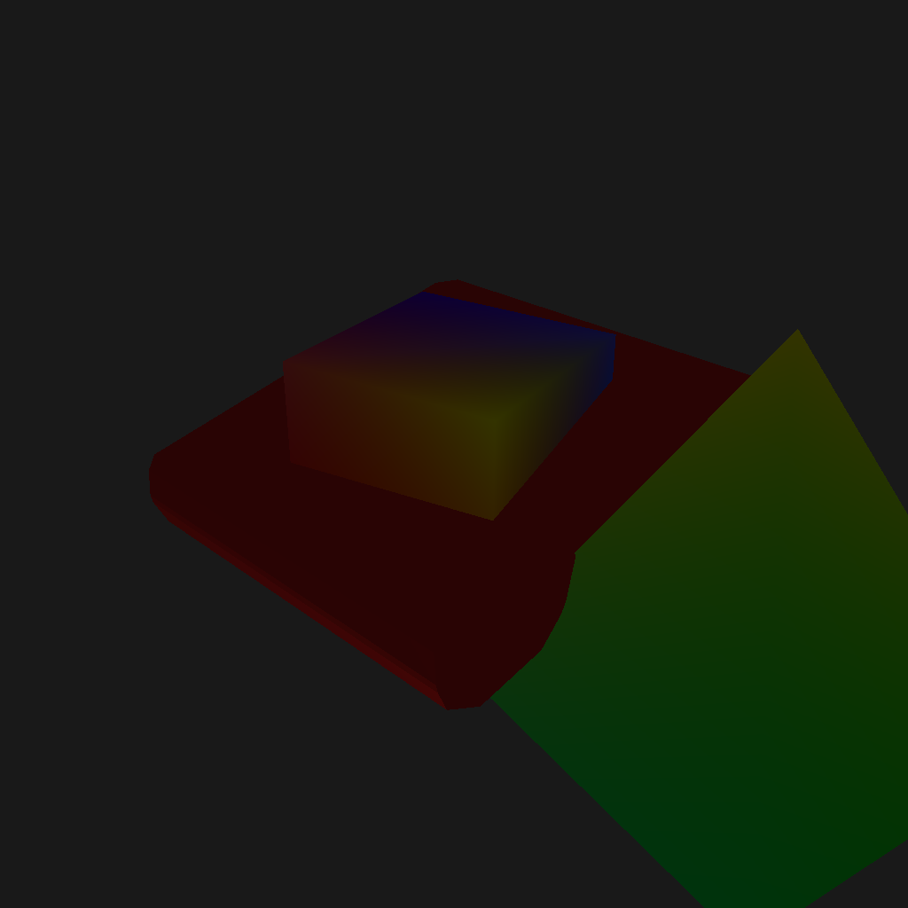

# WGPU - cli - 2

This experimentation attempts to use WGPU to render a 3D scene to set of png files.

Also includes an unfinished attempt to render step files.

It is based on the [screen-13-cli-1](../screen-13-cli-1) example.

## Running

```
cargo run --release
```

## Output

The program generates a png file called `asserts/cube_nnn.png` (the first one is shown below)



## Models

Step files come from here: https://www.3dcontentcentral.com/parts/part.aspx?id=263553&catalogid=171

* LQFP64 - by Michael Ludwig

## Donations

If you find this project useful, please consider making a donation via Ko-Fi or Patreon.

* Ko-fi: https://ko-fi.com/dominicclifton
* Patreon: https://www.patreon.com/MakerPnP

## Links

Please subscribe to be notified of live-stream events so you can follow further developments.

* Patreon: https://www.patreon.com/MakerPnP
* Source: https://github.com/MakerPnP
* Discord: https://discord.gg/ffwj5rKZuf
* YouTube: https://www.youtube.com/@MakerPnP
* X/Twitter: https://x.com/MakerPicknPlace

## Authors

* Dominic Clifton - Project founder and primary maintainer.

## License

Dual-licensed under Apache or MIT, at your option.

## Contributing

If you'd like to contribute, please raise an issue or a PR on the github issue tracker, work-in-progress PRs are fine
to let us know you're working on something, and/or visit the discord server.  See the  section above.
